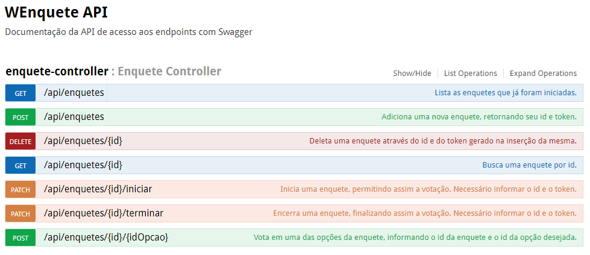

# WEnqueteAPI
Api de enquetes anônimas feita em java com: 
-	Spring Boot
-	Flyway (Versionamento de banco de dados)
-	Swagger (Documentação da API)
-	H2 (Banco de dados em memória para desenvolvimento e testes)
-	PostgreSQL
-	TravisCI (Integração contínua)
-	MockMvc (Testes de integração)

A API permite a criação de enquetes anônimas, compostas por uma pergunta e uma lista de opções. A API segue o seguinte fluxo:
-	criar enquete com uma pergunta e uma lista de opções.
-	iniciar a enquete, permitindo votar nas opções
-	votar anonimamente em uma das opções 
-	terminar a enquete, impossibilitando novas votações
-	deletar a enquete

A documentação está disponivel via Swagger na URL host:porta/swagger-ui.html, como no exemplo abaixo:

